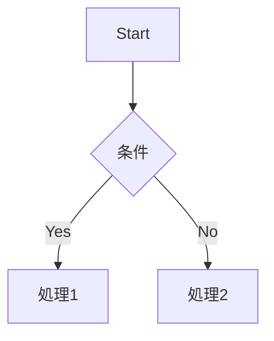
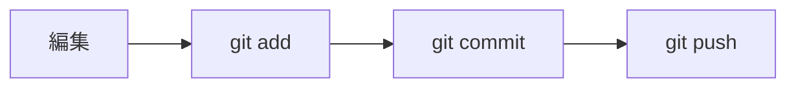
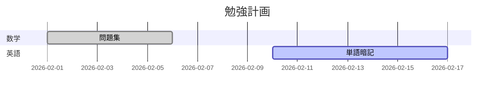
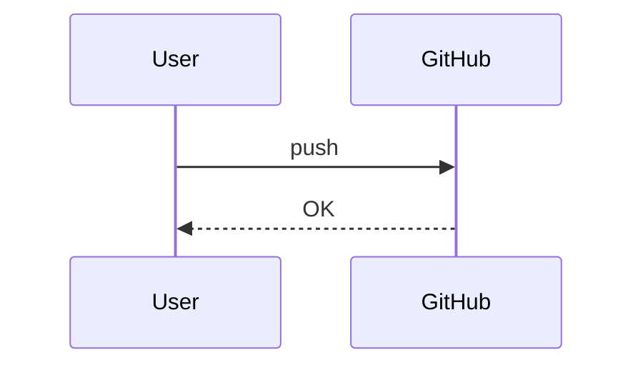

# Ultimate Markdown Guide for GitHub

**GitHubでよく使うMarkdown記法まとめ（基本＋応用＋LaTeX＋Mermaid）**

---
<details>
<summary>INDEX</summary>

- [Ultimate Markdown Guide for GitHub](#ultimate-markdown-guide-for-github)
  - [1. 見出し](#1-見出し)
  - [2. 強調](#2-強調)
  - [3. 箇条書き](#3-箇条書き)
    - [順序なしリスト](#順序なしリスト)
    - [順序ありリスト](#順序ありリスト)
  - [4. チェックリスト](#4-チェックリスト)
  - [5. リンク・画像](#5-リンク画像)
  - [6. コード](#6-コード)
    - [インラインコード](#インラインコード)
    - [コードブロック](#コードブロック)
  - [7. 表](#7-表)
  - [8. 引用](#8-引用)
    - [応用](#応用)
  - [9. 折りたたみ](#9-折りたたみ)
  - [10. HTML混ぜ技](#10-html混ぜ技)
  - [11. バッジ](#11-バッジ)
  - [12. LaTeX（数式）](#12-latex数式)
    - [インライン数式](#インライン数式)
    - [ブロック数式](#ブロック数式)
    - [よく使う数式記号](#よく使う数式記号)
  - [13. Mermaid（図）](#13-mermaid図)
    - [フローチャート](#フローチャート)
    - [Gitの流れ](#gitの流れ)
    - [ガントチャート](#ガントチャート)
    - [シーケンス図](#シーケンス図)
  - [README強者ポイント](#readme強者ポイント)

</details>

---

## 1. 見出し

```markdown
# 見出し1
## 見出し2
### 見出し3
```

---

## 2. 強調

```markdown
**太字**
*斜体*
~~取り消し線~~
```

**表示例：**
- **太字**
- *斜体*
- ~~取り消し線~~

---

## 3. 箇条書き

### 順序なしリスト

```markdown
- 項目1
- 項目2
  - ネスト1
  - ネスト2
```

**表示例：**
- 項目1
- 項目2
  - ネスト1
  - ネスト2

### 順序ありリスト

```markdown
1. いち
2. に
3. さん
```

**表示例：**
1. いち
2. に
3. さん

---

## 4. チェックリスト

```markdown
- [ ] 未完了
- [x] 完了
```

**表示例：**
- [ ] 未完了
- [x] 完了

---

## 5. リンク・画像

```markdown
[Google](https://www.google.com)


```

**表示例：**
- [Google](https://www.google.com)
- 

---

## 6. コード

### インラインコード

```markdown
インライン: `git clone`
```

**表示例：** インライン: `git clone`

### コードブロック

````markdown
```bash
git clone https://github.com/username/repository.git
```
````

**表示例：**
```bash
git clone https://github.com/username/repository.git
```

---

## 7. 表

```markdown
| 項目 | 内容 |
|------|------|
| 名前 | りょう |
| 用途 | 勉強ログ |
```

**表示例：**

| 項目 | 内容 |
|------|------|
| 名前 | りょう |
| 用途 | 勉強ログ |

---

## 8. 引用

```markdown
> これは引用です。
```

**表示例：**
> これは引用です。

### 応用
```markdown
> [!NOTE]
> 補足説明

> [!TIP]
> ちょっとしたコツ

> [!IMPORTANT]
> 重要事項

> [!WARNING]
> 注意が必要

> [!CAUTION]
> 危険・慎重に
```

**表示例：**
> [!NOTE]
> 補足説明

> [!TIP]
> ちょっとしたコツ

> [!IMPORTANT]
> 重要事項

> [!WARNING]
> 注意が必要

> [!CAUTION]
> 危険・慎重に


---

## 9. 折りたたみ

```html
<details>
<summary>クリックで開く</summary>
ここに詳細を書く。
</details>
```

**表示例：**
<details>
<summary>クリックで開く</summary>
ここに詳細を書く。
</details>

---

## 10. HTML混ぜ技

```html
<p align="center">中央寄せテキスト</p>

<br>
<!-- 表示されないコメント -->
```

**使い方：**
- `<p align="center">` で中央寄せ
- `` で画像サイズ指定
- `<br>` で改行
- `<!-- コメント -->` で非表示コメント

---

## 11. バッジ

```markdown


```

**表示例：**


---

## 12. LaTeX（数式）

### インライン数式

```markdown
$e^{i\pi} + 1 = 0$ 
```

**表示例：**  
 $e^{i\pi} + 1 = 0$ 

### ブロック数式

```markdown
$$
\frac{d}{dx} x^2 = 2x
$$

$$
ax^2 + bx + c = 0
$$

$$
x = \frac{-b \pm \sqrt{b^2 - 4ac}}{2a}
$$
```

**表示例：**

$$
\frac{d}{dx} x^2 = 2x
$$

$$
ax^2 + bx + c = 0
$$

$$
x = \frac{-b \pm \sqrt{b^2 - 4ac}}{2a}
$$

### よく使う数式記号

- `$\sqrt{x}$` → $\sqrt{x}$ (平方根)
- `$\sum_{i=1}^n$` → $\sum_{i=1}^n$ (総和)
- `$\int_a^b$` → $\int_a^b$ (積分)
- `$\lim_{x \to 0}$` → $\lim_{x \to 0}$ (極限)
- `$a^2 + b^2 = c^2$` → $a^2 + b^2 = c^2$ (ピタゴラスの定理)

---

## 13. Mermaid（図）

### フローチャート

````markdown

````

**表示例：**


### Gitの流れ

````markdown

````

**表示例：**


### ガントチャート

````markdown

````

**表示例：**


### シーケンス図

````markdown

````

**表示例：**


---

## README強者ポイント

- ✅ 最初に概要を書く
- ✅ 目次をつける
- ✅ 折りたたみを活用
- ✅ バッジを上に配置
- ✅ 無駄に長くしすぎない

---

**作成日：** 2026年2月16日  
**用途：** GitHub README作成リファレンス  
**制作協力：** ChatGPT,Claude