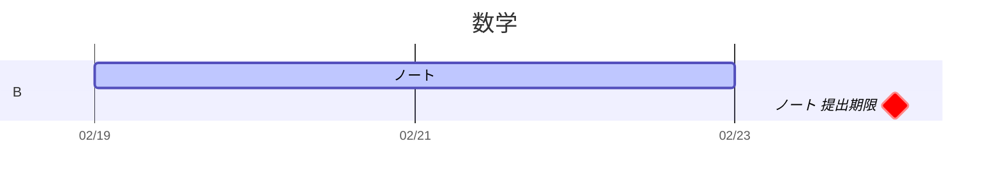

# Task Progress

## tasks
- [ ] ノート（02-24提出）

## Gantt

```mermaid
gantt
    title 数学
    dateFormat  MM-DD
    axisFormat %m/%d
    tickInterval 2day

    section B
    ノート     :active, 02-19, 4d
    ノート 提出期限 :crit, milestone, 02-24, 0d

```
