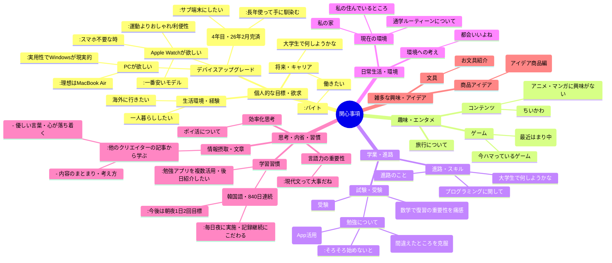

```mermaid
mindmap
  root((関心事項))

    個人的な目標・欲求
      デバイスアップグレード
        iPhone 13 mini (4年目・26年2月完済)
          :長年使って手に馴染む
          :サブ端末にしたい
        Apple Watchが欲しい
          :一番安いモデル
          :運動よりおしゃれ/利便性
          :スマホ不要な時
        PCが欲しい
          :理想はMacBook Air
          :実用性でWindowsが現実的
      生活環境・経験
        一人暮らししたい
        海外に行きたい
      将来・キャリア
        働きたい
          :バイト
        大学生で何しようかな
    趣味・エンタメ
      ゲーム
        今ハマっているゲーム
        ポケモン(最近はまり中)
      コンテンツ
        ちいかわ
        アニメ・マンガに興味がない
      旅行について

    学業・進路
      試験・受験
        受験
        共通テスト(数学で復習の重要性を痛感)
        勉強について
          :そろそろ始めないと
          :英検(App活用)
          復習の大切さ(間違えたところを克服)
      進路・スキル
        進路のこと
        プログラミングに関して
        大学生で何しようかな

    日常生活・環境
      現在の環境
        私の家
        私の住んでいるところ
        通学ルーティーンについて
      環境への考え
        都会いいよね

    思考・内省・習慣
      効率化思考
        ポイ活について
      学習習慣
        Duolingo(韓国語・840日連続)
          :毎日夜に実施・記録継続にこだわる
          :今後は朝夜1日2回目標
        :勉強アプリを複数活用・後日紹介したい
      情報摂取・文章
        :他のクリエイターの記事から学ぶ
          - 優しい言葉・心が落ち着く
          - 内容のまとまり・考え方
      言語力の重要性
        :現代文って大事だね

    雑多な興味・アイデア
      文具
        お文具紹介
      商品アイデア
        ほしいもの(アイデア商品編)
```