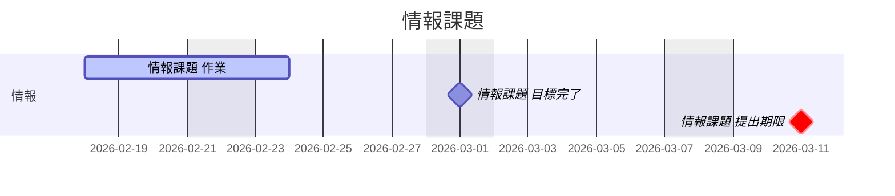
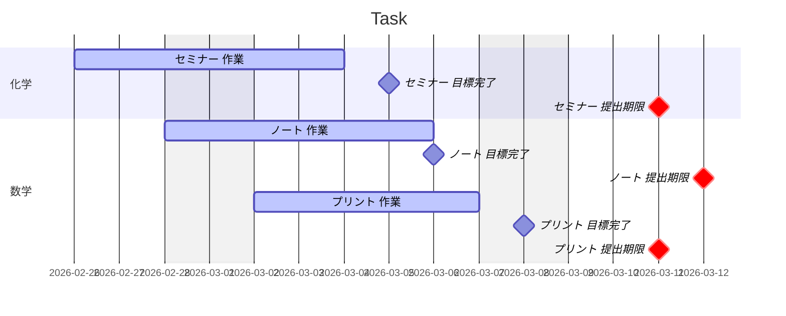

- [Task Progress](#task-progress)
  - [tasks](#tasks)
  - [Gantt](#gantt)
- [Task Progress](#task-progress-1)
  - [tasks](#tasks-1)
  - [Gantt](#gantt-1)

# Task Progress

## tasks
- [ ] 情報課題（03-11提出）

## Gantt

# Task Progress

## tasks
- [ ] セミナー（03-11提出）
- [ ] ノート（03-12提出）
- [ ] プリント（03-11提出）

## Gantt

