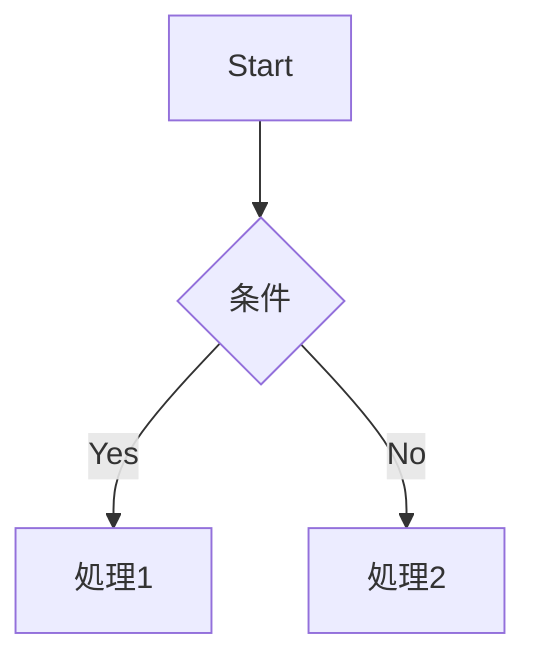
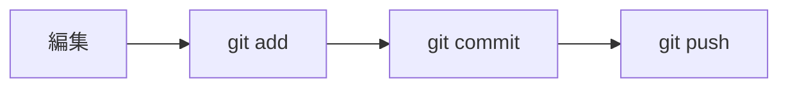
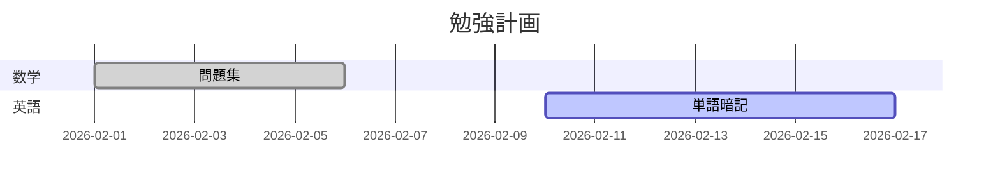
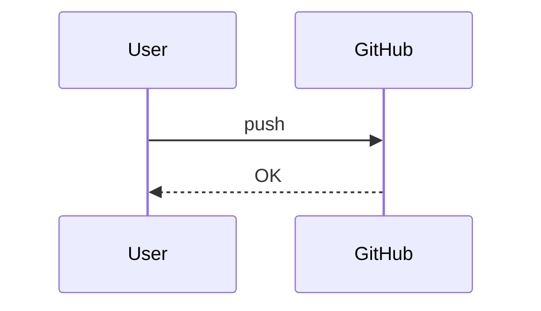

# Ultimate Markdown Guide for GitHub

GitHubでよく使うMarkdown記法まとめ（基本＋応用＋LaTeX＋Mermaid）

------------------------------------------------------------------------

## 1. 見出し

# 見出し1

## 見出し2

### 見出し3

------------------------------------------------------------------------

## 2. 強調

**太字**\
*斜体*\
~~取り消し線~~

------------------------------------------------------------------------

## 3. 箇条書き

-   項目1
-   項目2
    -   ネスト1
    -   ネスト2

1.  いち
2.  に
3.  さん

------------------------------------------------------------------------

## 4. チェックリスト

-   [ ] 未完了
-   [x] 完了

------------------------------------------------------------------------

## 5. リンク・画像

[Google](https://www.google.com)


------------------------------------------------------------------------

## 6. コード

インライン: `git clone`

``` bash
git clone https://github.com/username/repository.git
```

------------------------------------------------------------------------

## 7. 表

  項目   内容
  ------ ----------
  名前   りょう
  用途   勉強ログ

------------------------------------------------------------------------

## 8. 引用

> これは引用です。

------------------------------------------------------------------------

## 9. 折りたたみ

```{=html}
<details>
```
```{=html}
<summary>
```
クリックで開く
```{=html}
</summary>
```
ここに詳細を書く。

```{=html}
</details>
```

------------------------------------------------------------------------

## 10. HTML混ぜ技

```{=html}
<p align="center">
```
中央寄せテキスト
```{=html}
</p>
```
``{=html}

`<br>`{=html}

```{=html}
<!-- 表示されないコメント -->
```

------------------------------------------------------------------------

## 11. バッジ

\


------------------------------------------------------------------------

## 12. LaTeX（数式）

インライン：\
オイラーの公式は $e^{i\pi} + 1 = 0$ です。

ブロック数式：

$$
\frac{d}{dx} x^2 = 2x
$$

よく使う例：

-   $\sqrt{x}$
-   $\sum_{i=1}^n$
-   $\int_a^b$
-   $\lim_{x \to 0}$
-   $a^2 + b^2 = c^2$

------------------------------------------------------------------------

## 13. Mermaid（図）

### フローチャート



### Gitの流れ



### ガントチャート



### シーケンス図



------------------------------------------------------------------------

## README強者ポイント

-   最初に概要を書く
-   目次をつける
-   折りたたみを活用
-   バッジを上に配置
-   無駄に長くしすぎない
